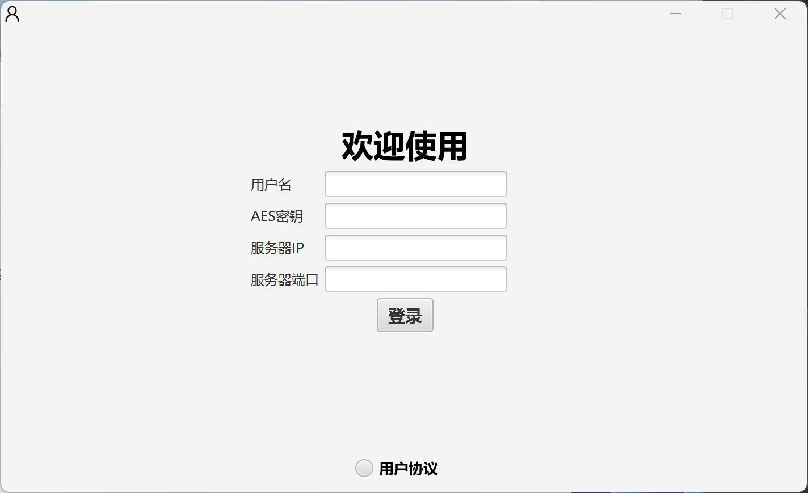
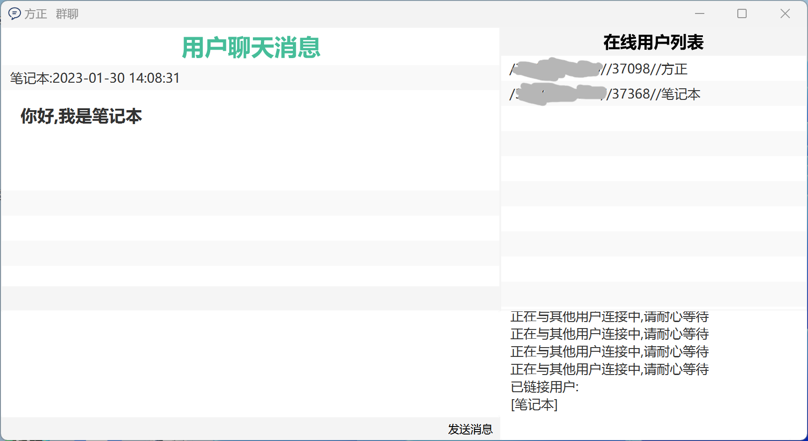
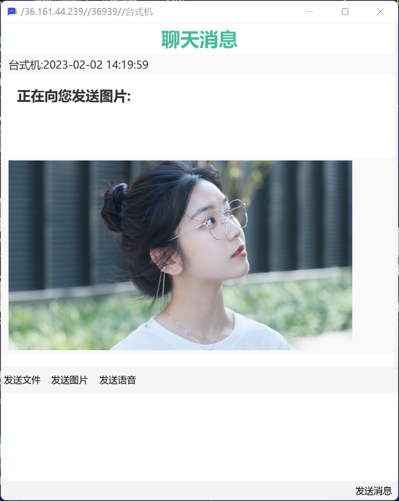

# Pchatsrc

需要一个RSA的公钥连接到服务器,新建文件名为RSAKEY,不需要.txt

需要新建文件夹 temp---存储临时文件,image--存储接收到的图片,file--存储接收到的文件,record--存储录音,voice--存储接收到的语言消息,done--存储已经阅读过的图片和语言,allmessage--存储群聊消息,message--存储私聊的消息

群聊只可以发送文字消息,私聊支持发送文件/语言/图片
## 2.5日更新->支持实时语言视频聊天(测试版本,存在未知bug,希望得到您的报告)
## 2.6日更新->优化了视频通话部分,解决了无法关闭麦克风的问题,新增了对于NAT类型的判断,剔除了对称形NAT用户,优化了系统占用,CPU占用率降低至35%(使用R5 3600测试)
## 2.7日更新->进一步优化系统占用,CPU占用率下降至13%(R5 3600测试),优化视频通话的体验,提高稳定性

